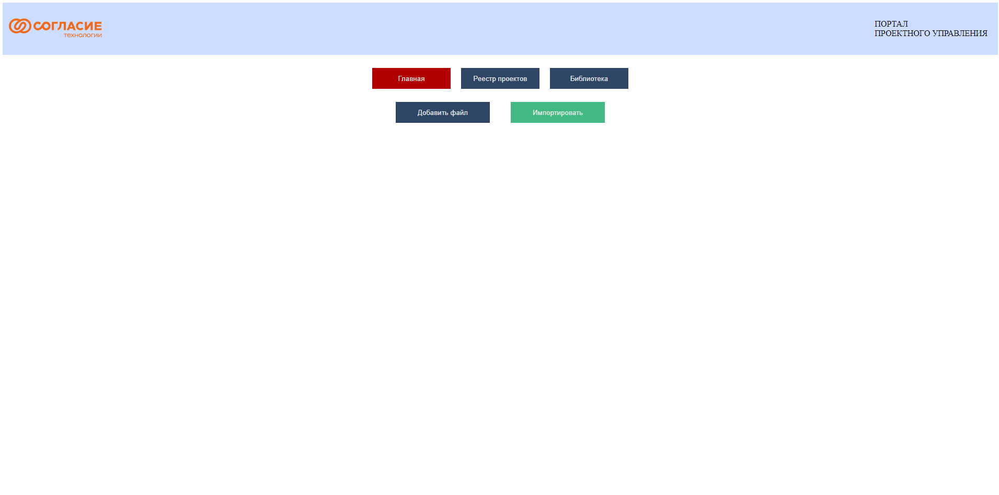
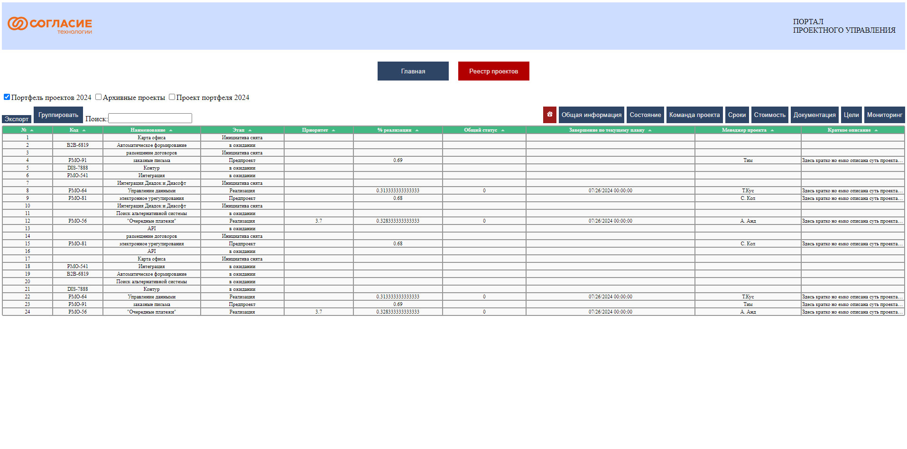

# Портал управления проектами

Веб-приложение, позволяющее импортировать данные из Excel файла (.xlsx), отображать их в виде отдельных таблиц, фильтровать, использовать полнотекстовый поиск, экспортировать каждую из таблиц в Excel файл (.xlsx).

[Техническое описание проекта](https://docs.google.com/document/d/19AKt8VYdl8kiwOCnpui8e52EAyh1Eat9/edit?usp=sharing&ouid=111081525006516971451&rtpof=true&sd=true)

## Инструкция по развёртке и установке решения
Для запуска приложения потребуется Docker. Скачайте репозиторий и запустите команду в корне проекта:
```docker
    docker-compose up -d
```

В запущенных котнейнерах поднимаются бэкенд, фронтенд и база данных.

Основное окно приложения доступно по ссылке:
http://localhost:5173/

С помощью Swagger можно изучить и протестировать Backend API:
http://localhost:5000/swagger/index.html

## Скриншоты сервиса



## Предложения по масштабированию
Для масштабирования сервиса можно:
- Проработать систему аутентификации на основе корпоративной системы
- Перенести работу веб-приложения на HTTPS,
- Оптимизировать работу базы данных под заданный формат

## Особенности бэкенда
В нём работа с таблицами реализовна по большему счёту путём чтения данных из представлеинй Postgres, что позволило унифицировать и шаблонизировать взаимодействие с ними внутри ASP.NET
Примеры файлов:
- ViewService.cs
- ViewRepository.cs
